# 如何让Word自动编号？
### 制作方案和标书是一件繁琐的事情，除了内容是重头之外，格式也是一件很麻烦的事情，不困难，就是很繁琐，手动整理费时费力。

#### 虽然，工具无法帮人加快对知识的认知，但是可以加快认知知识过程中的效率。
#### 所以，请善用工具。

学习工具过程是个反复痛苦的过程，耐心对待，方可达成效果~
1. 首先打开Word，任意编辑文字，建议先编辑大纲或者先编辑一级目录和一级目录子目录，如下图；
> 我使用的是office2010，比较旧，但是工具名称一样，只是放的位置不同；
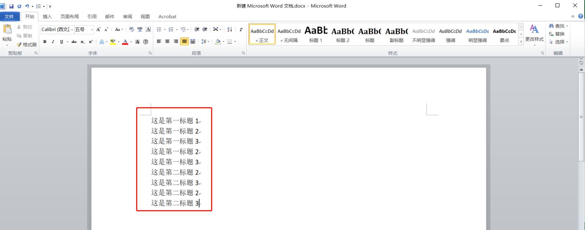
2. 点击【段落】中 “多级列表”功能边的向下小三角，选择【定义新的多级列表】；
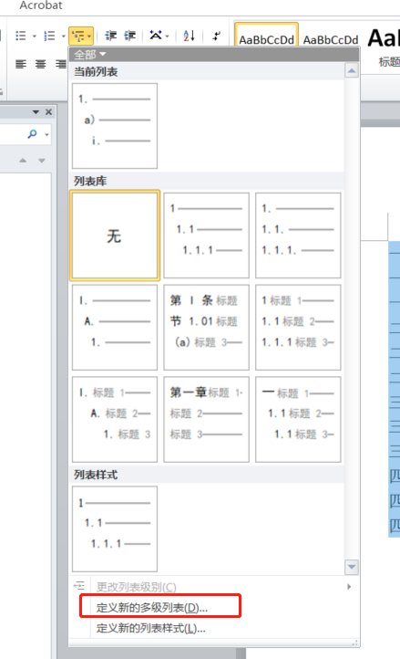
3. 出现以下弹窗，进行编辑；
    - 点击【1】，调整1级的编号格式，我习惯性用汉字“一”作为一级目录，顺便调整字体，可根据标书要求调整，无要求默认一级目录字体为“黑体，三号，无颜色，不加粗”
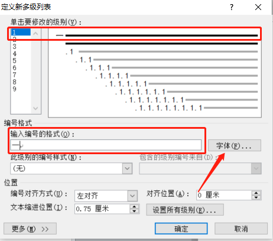
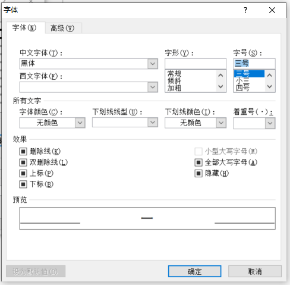
   - 点击弹框中的【更多】，如下图设置，是编号【一】绑定格式的标题1，方便后面直接套用文本格式；
    ::: warning 注意
    当修改的级别为图中所示的【1】时，【级别链接样式】要同步选择【级别1】
    :::
    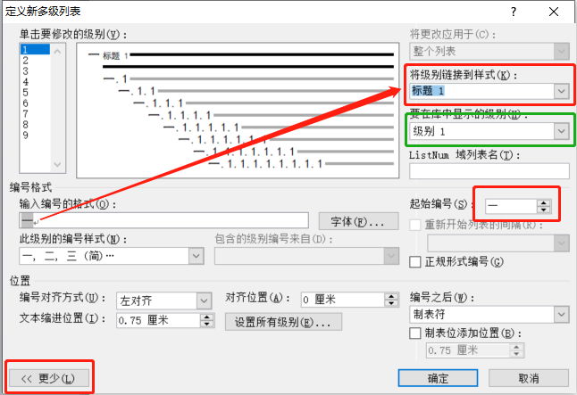
    - 从第二级开始，如果要正常显示阿拉数字，则勾选图标2【正式形式编号】，同样将其绑定【标题2】，弹窗右上角为调整后预览效果；
    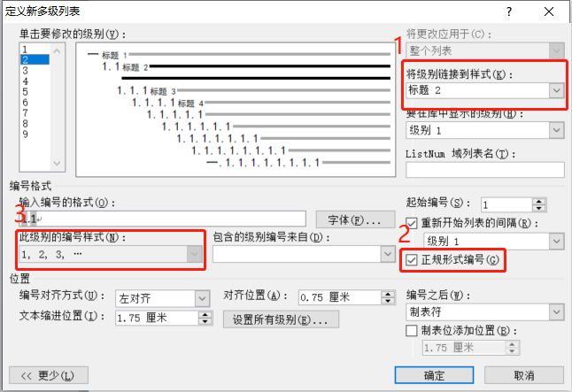
    - 设置完成后，点击【确定】，返回文本中进行编辑测试，会得到这个效果：
    > 选中所有文本，点击【多级列表】的小三角形，点击刚刚设置的模板；
    
    > 点击【确定】会直接套用，接下来，该模板会出现在【多级列表】的“当前列表“处，鼠标右键，将其加入列表库；
    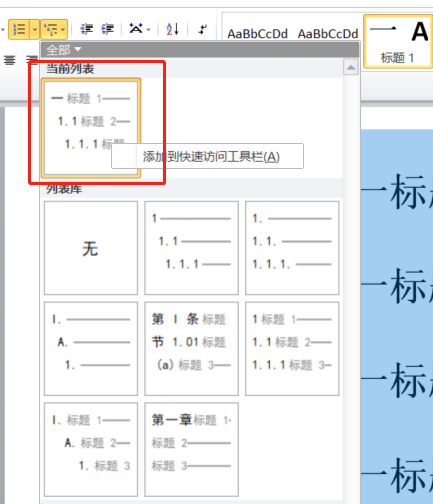
    > 这时，由于之前设置的都是正文，所以都是一级列表，点击键盘的”tab“按钮，快捷方式形成第二层级，或者点击菜单中的【开始】栏，手动选标题1，2，3……
    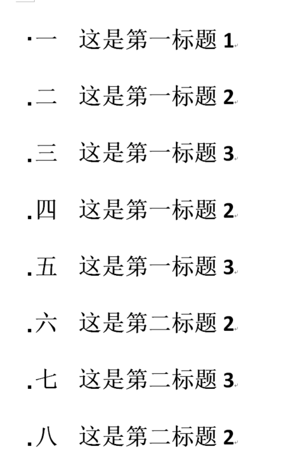
    > 调整之后的效果就是这样了。
    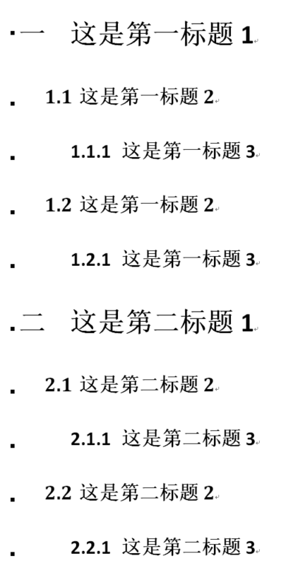
#### 当根据上面设置后不能达成效果，或者效果不理想，出现以下情况时：
 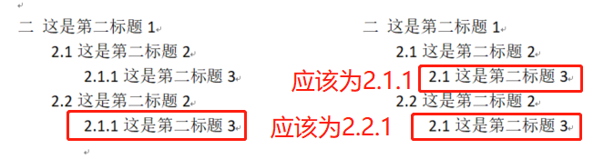
#### 采取如下解决办法
1. 将鼠标放在显示【二】的层级处，点开熟悉的【多级列表】功能
 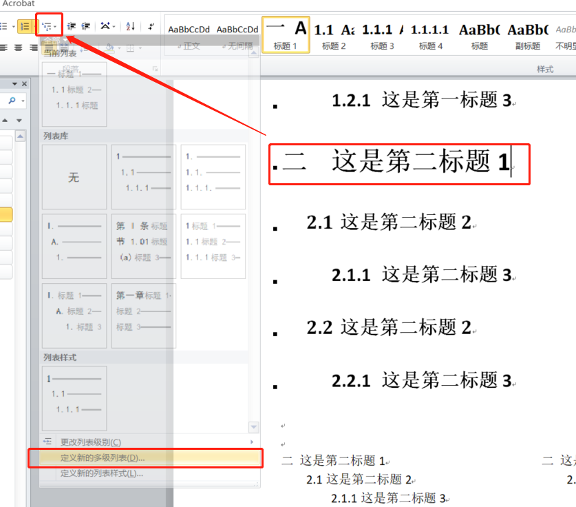
2. 弹窗会自动变成以【二】为预览的层级分列；
3. 这是从第3级开始，将【要在库中显示的级别】修改为级别2，将【包含的级别编号来自】修改为级别2，这时编号格式会变形为“12..1”，需要手动调整为“2.1.1”；
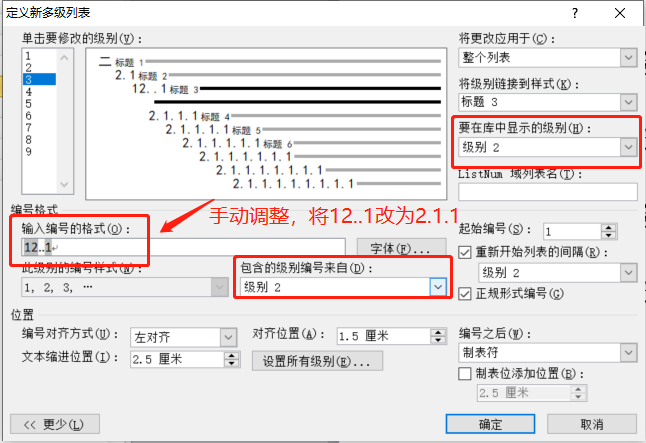
::: warning 注意
如果手动调整后，当有新的编号从标题2到标题3跳换时，都需要手动调整了，但标题2和标题3同级内的编号会自动往下编。
:::
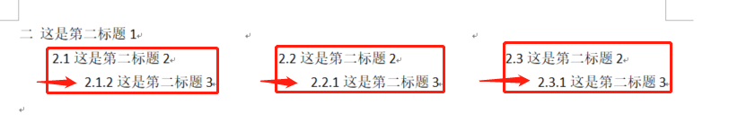
4. 但是，一般情况下，只有较老无人维护的office版本可能会出现此现象，其他的按照一开始的教程是毫无问题的；
5. 建议此操作投入生产前，请多次测试演练后再存为模板。
::: warning tips
Google了很多教程，发现都不够清晰。
所以我就自己研究了一下。这是目前研究word自动编号成功的方法，并非最优解，在实操过程如果发现更好的，会重新更新。
如果大家发现其他更好的方法，还望不吝赐教~
:::
