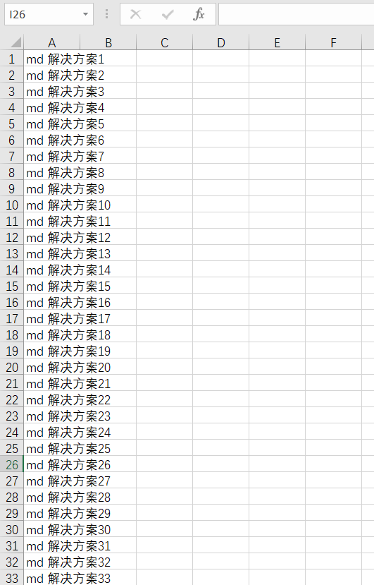
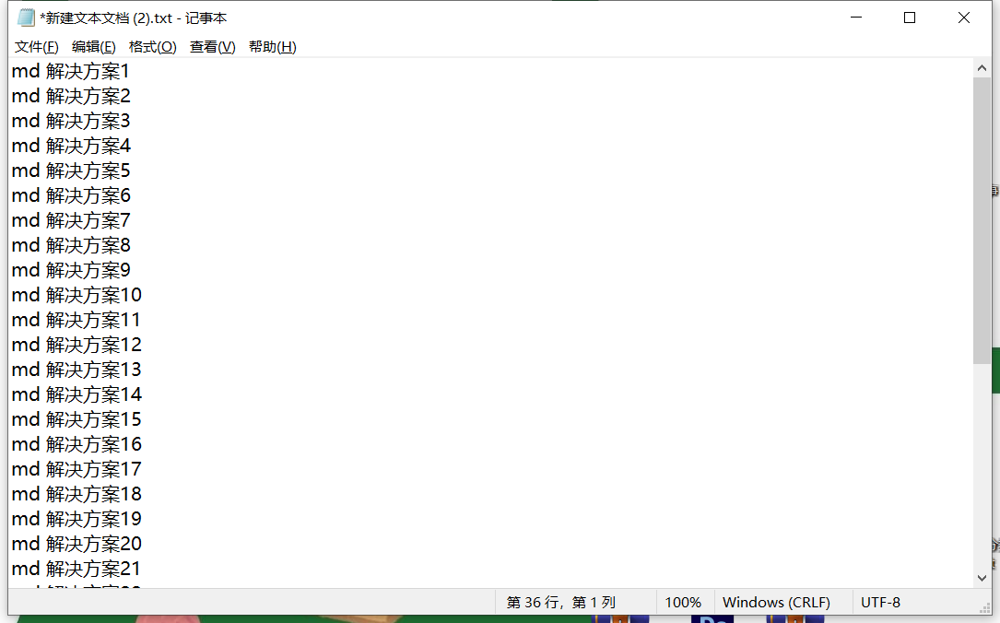
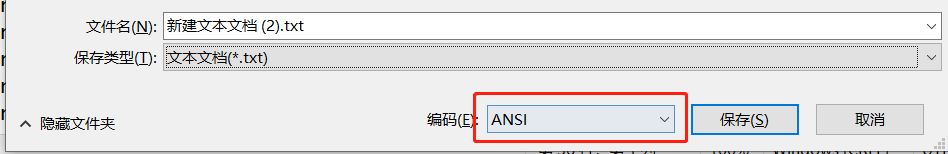
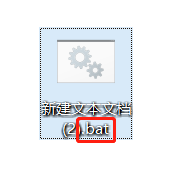
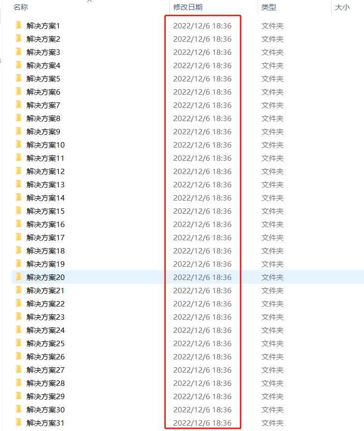

# 用5秒快速生成100个文件夹

## 背景

我在搭建售前工具包的时候，要给以往的文件重新归类，尤其是产品相关的文件,文件夹分类其实都是一样的，例如：

**脱敏产品**
- 宣讲PPT
- 技术方案
- 操作手册
- 宣传册
- 操作视频
- 招投标
- 一指禅
- 案例分享
- ……
    
像上面这样的文件夹，每个产品都是重复的，于是我找了个方法批量生成文件夹，这样只需要做分类，无需手动创建文件了。

## 解决办法

**1. 打开excel将文件夹目录准备好，并在每个标题前加“md "，如图：**

::: warning 注意
md和标题之间有空格。
:::

**2. 新建一个.txt文件，并将excel的目录复制进去;**

> 如觉得步骤一繁琐，或者文件夹并没那么多的， 可直接在步骤二中进行；

**3. 把.txt文件“另存为”后，找到编码处，将UTF-8修改为 `ANSI`；**

> 如不修改，会无法执行脚本；

**4. .txt文件后缀修改为.bat;**

**5. 将.bat文件复制粘贴到需要生成文件夹的地方，双击执行，大概等待2秒即可批量生成所需文件夹；**

**生成完毕！需要重复使用的，只需把.bat文件复制粘贴到需要生成文件夹的文件下即可。**

