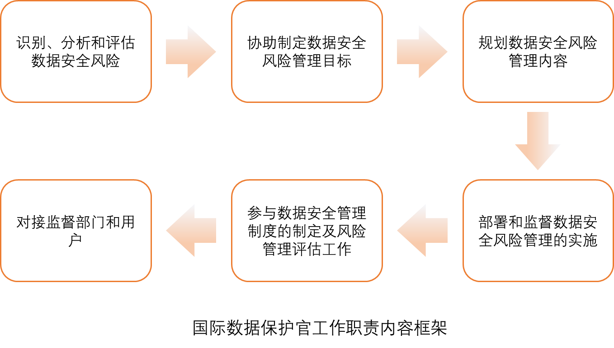
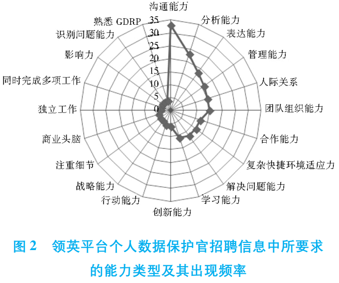

### 前言
自从人类有了文字之后，文字成为了“新武器”，国家首脑和军队应该是首批感受到信息安全重要性的，也明白必须使用一些方法保障信息泄露和被篡改。
早在公元前1900年，防护信息安全的解决方案就已存在，如古埃及的军队就利用错位加密来传递信息，可见信息加密从古至今都是一门重要的学问。
时至今日，密码学已经成为一门专业学科，时时刻刻服务着亿万人的信息安全。
数据承载信息，信息落地于数据。保护数据安全是做好信息安全防护的一把利剑。人类社会，科技日新月异，越来越多的信息线上化，通过二进制数据承载，因此可以断言，**防护数据安全绝对是信息安全防护的最终归宿。**
顺天应势，**数据安全官**将成为各大企业内部统筹数据安全、推进数据价值实现的得力军师。
### 何为数据安全官
闻道有先后，术业有专攻。
早在1978年德国发布的《联邦数据保护法案》（BDSG）中，就已经有了与数据安全官相似职位的制度规定，旨在对数据处理过程进行监督。
1995年欧盟发布的《数据保护指令》中开始使用DPO（数据保护官）概念，并在指令中对DPO的职责权力等内容进行了丰富和补充。
但此前对此岗位的实施并非强制性的。
最终在2018年GDPR发布后，制度中明确规定，必须依法设立DPO（数据保护官）。由此，可见数据安全的建设趋势愈发规范化。
数据安全官、数据保护官虽在每个国家中的叫法不同，但大概的含义范围其实是相通的：
:::
他们是恰当、及时参与所有敏感数据保护的管理者，负责所在组织机构的敏感数据安全，为此制定策略，并保证该策略符合国家法规、行业标准、公司业务发展等的需求。
:::
### 数据安全官的职责
根据学习、收集到的资料，以及国内对此岗位的要求，数据安全官的职责大体分为以下几点：

### 数据安全官的素质要求
• 掌握相关法律法规知识和行业规范知识；
• 企业IT架构体系知识和对应工具使用技能；
• 具有钻研行业领域精神，熟悉该行业业务流程，网络架构等相关知识；
• 掌握基本的管理知识和跨部门协作沟通能力；
• 问题敏感性、推理能力、表达能力、理解能力、细节观察能力、分类灵活性和信息排序能力等

### 结束语
综上，是基于数据安全官培训课程所感所想后，规整资料所得。
目前国内并没有对数据安全官的法律地位和职责内容进行详细规定，但是在各相关上位法中也提及了对应的人才培养，如：
• 《数据安全法》第二十条表明国家支持教育、科研机构和企业等开展数据开发利用技术和数据安全相关教育和培训，采取多种方式培养数据开发利用技术和数据安全专业人才。
• 《个人信息保护法》第五十二条、第五十三条、第五十四条指出当处理个人信息达到国家网信部门规定数量的个人信息处理者应当制定个人信息保护负责人，该负责人负责对处理活动及采取的保护措施进行监督、报送、合规审计等。
数据安全的最终目的是为了更好、更安全的进行资源重组，是数据价值最大化，从其目的而言，未来数据安全官相关岗位会越来越成为企业数字化转型不可或缺的一员。
::: 注意
万事万物应当遵循“理”，而“理”的出处应该从万千实践中总结出来。请不要忘记，掌握知识的前提都是为了更好的实践，将理论结合实践使用，用实践反哺理论。
以上的观点仅为我个人初步理解，仅作参考。
::: 

参考文献：
• 《中外数据保护官制度分析级启示》相丽玲
• 《国外个人数据保护官的概念、职责与能力素质》宛玲
• 《中华人民共和国数据安全法》
• 《中华人民共和国网络安全法》
• 关于修改《中华人民共和国网络安全法》的决定（征求意见稿）
• 《中华人民共和国反电信网络诈骗法》
• 《中华人民共和国个人信息保护法》
• 《通用数据保护规范》（GDPR）