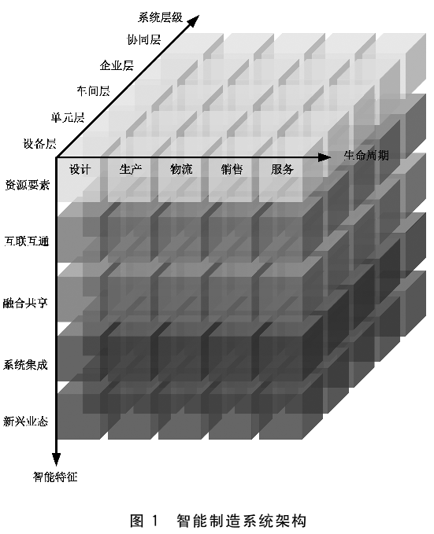
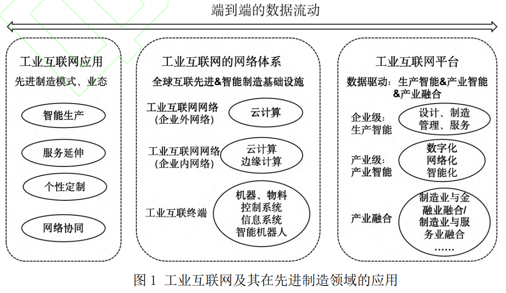

# 工业互联网到底是什么东东？
工业互联网作为关键信息基础设施，并非指某一特定行业。

> 如我们常说的教育、金融、物流等都为特定行业。

工业互联网的特殊在于，它是由2部分组成的：

1. 工业
2. 互联网

单独拆开2个领域理解，都比较好理解的，

`工业` 又称为第二产业，这些行业在一间产品的生产链种担任原料加工的工作，是该产品自生产至供应市场的中间阶段。
> 采矿：石油、油页岩
> 制造业：车辆、自行车、航空、船舶、国防
> 食品：肉加工、酒、烟草
>纺织：纺织、染整
> 皮草、造纸、化学（塑料）、制药、电子工业（半导体）
>能源：电力、可再生资源
> 建筑

`互联网` 是指网络与网络之间所串而连成的一个逻辑上的单一巨大国际网络，这些网络以一组通用的协议相连。

**故，工业互联网，即带有工业特性，又带有互联网特性**

在探讨 `工业互联网` 的业务模式之前，我们先来系统地学习一下 `工业` 在业务上的系统架构。

## 工业

> 以智能制造业为例，进行分析

`智能制造业` 与传统制造业的区别在于制造活动具有自感知、自决策、自执行、自学习、自适应之类的功能特征

其在系统架构上主要分为3个维度，故而有了三个逻辑层：

1. 系统层级：包含设备层、单元层、车间层、企业层、协同层

2. 智能特征：包含资源要素、互联互通、融合共享、系统集成、新型业态

3. 生命周期：包含设计、生产、物流、销售、服务

> 在国标《智能制造 工业数据 分类原则》中，也采用此模型进行划分

从上文解释的，智能制造业和传统制造业的不同点在于智能约=自动约=数据利用。

对于工业行业而言，数据的价值在于汇聚与提炼，从而能够帮助他们更好的进行市场分析、商业决策、性能调优等。

那这些数据存在哪些系统里面，分别起什么作用呢？

下面一一揭晓。
### 系统层次

1. 设备层：传感器、仪表、数控装备、智能机床、射频识别、工业机器人及各类自动化分拣和仓储管理设备。
> 主要用于采集前线设备信息。

2. 单元层：PLC、DCS、SCADA、远程终端单元(RTU）等
> 主要用于管理设备层采集上来的数据，故涵盖一些控制系统数据、网络参数数据等。

3. 车间层：计算机辅助制造系统（CAP）、CAD、制造执行系统、质量管理系统、仓库管理系统、实验室管理系统、计量系统、HSE（健康、安全和环境）管理系统
> 主要用于管理产品设计过程的工艺信息、生产过程的质量信息、人员信息、物料、计划、监测计量信息等

4. 企业层：产品全生命周期管理（PLM）、CAD、计算机辅助工艺过程设计（CAPP）、企业资产管理、ERP、SCM、客户管理CRM、网络安全管理、物流信息系统等
> 主要用于管理成本、人员、市场、技术、供应链、调度、质量、服务等相关信息
5. 协同层：远程运维系统、协同设计研发系统、协同采购系统、协同生产系统等互联网平台系统.
> 主要用于进行各部门、区域、供应商等之间协同作业过程中的辅助系统，故涵盖协同策略、协同管理等信息。

### 产品全生命周期
1. 设计阶段：ERP、MES
> 包含一些BOM数据、产品配方、工艺、产能等信息

2. 生产阶段：厂区监控系统（SIS）、ERP、人力、财务、MES、过程控制系统
>包含生产过程的原料配比、计划调度、工艺运行状态、设备、质量、成本、耗能、环保等相关信息

3. 物流阶段：ERP、MES、SCM系统
>包含采购的计划、方案、订单、合同、执行，以及发票、付款、供应方、仓储、物流运输等信息

4. 销售阶段：CRM、ERP、财务、人力资源系统
> 包含市场预测、资金管理、风险管理、客户管理、销售计划、报价、订单、合同、发票、款项等信息

5. 服务阶段：CRM、ERP系统
>包含售后服务方案、客户满意度、产品使用反馈、维修、增值等信息

讲完了工业上所会涉及到的业务环节及作用之后，我们再来看看互联网 都有哪些特性。

## 互联网

互联网顾名思义，是一张庞大、相互交织、可自主联系的网络体。从20世纪末起，计算机逐渐替代传统信件成为信的沟通手段开始，互联网就逐步发展、壮大。

互联网开始仅被学术界广泛使用，但随着商业化服务与技术的发展，很快便发展为电子商务的支撑主力。而后掌上计算机，也就是手机的普及与发展，移动互联网进入我们每个人的生活。

其主要有以下几个主要**特征**：

1. 全球性与开放性：不受地理位置的限制，任何人都能接入，并于其他人直接联系
2. 去中心化与分布式架构：与其他的通信设备不同，不需要再由第三方转接后才能进行联系，每对对象都是各自为中心的主体。
3. 可互操作性：不同的系统可以互相连接，形成交互
4. 信息多样性与共享：用户可以通过浏览器、搜索引擎等工具获取任何公开/非公开的信息
5. 实时性与即时性：打破空间与时间的限制，在地球的这一头和另一头都能及时在第一时间获取信息

## 工业互联网

工业互联网是新一代信息通信技术与先进制造业深度融合所形成的新型应用模式，能够满足工业智能化的要求，并在此基础上构建全新工业生态体系。

她的发展以大数据和物联网/互联网为基础，通过对端到端的工业数据处理，对生产流程进行智能控制，形成协同制造、定制服务等新型制造模式，实现工业先进制造技术的智能升级。

换句话而言，工业在工业互联网的推进下，以往各个维度各自发展的烟囱式形势，将会通过工业互联网而实现全面联通。对生产和经营过程的数据予以智能反馈，优化资源配置效率，实现制造全过程的效率提升，进而为进一步实现技术创新和组织 管理变革提供重要保障。

相比较工业，`工业互联网` 将从4个维度出发，涵盖：

平台、网络、数据、安全

### 平台
工业互联网平台是由类型、功能各异的应用所组成的新业态。通过工业互联网平台，制造业可以实现全要素、全产业链、全价值链的全面链接，将从研发、生产、管理、服务等多方面，重组业务流程并重塑产业生态。

### 网络
高质量外网建设实现全国地市全覆盖、5G基站建设、标识解析五大顶级节点等建设内容将成为工业互联网的网络支撑力量。

### 数据
国家工业互联网大数据中心、分中心体系正在加速建设，是工业数据汇聚、数据共享、数据再利用的美好开端。依靠数据实现智能化决策、自动化执行、自学习、自感应是工业领域融入工业互联网的目标之一。

### 安全
随着设备、平台之间逐步形成互联互通、上云等发展，如何保障工业互联网在运作过程的安全也成了重点建设内容之一。为此，国家、省、企业三级协同联动的技术监测服务体系基本建成，安全监测范围覆盖14个重要工业领域。安全体系保障能力需协同工业互联网的发展持续提升。

### 业务模式

工业互联网将传统工业与互联网技术相结合，实现生产、管理和服务的数字化、网络化和智能化的模式。其范围涵盖了工业生产、供应链管理、设备监控、数据分析等方面，旨在提升工业领域的效率、灵活性和创新能力。以下是一些常见的工业互联网业务模式：

1. 数据驱动的增值服务模式： 基于工业设备、生产线和产品的传感器数据收集、分析和应用，提供增值服务。例如，通过设备监测和数据分析，提供远程诊断、预测性维护和优化方案，帮助企业降低故障率、提高生产效率和产品质量。

2. 智能制造与工厂优化模式： 运用互联网技术和数字化技术，实现生产过程的智能化和优化。通过物联网、大数据分析和人工智能等技术，实时监控和优化生产线、设备和物料流动，提高生产效率、降低成本和能源消耗。

3. 开放平台与生态系统模式： 建立开放的工业互联网平台，吸引多方参与者（如设备制造商、软件开发商、解决方案提供商）共同开发和交互。通过平台的数据共享、应用开发和合作创新，形成多方协同的工业互联网生态系统，促进技术创新和业务模式创新。

4. 供应链智能化与可视化模式： 利用工业互联网技术实现供应链的数字化、智能化和可视化管理。通过信息共享、协同决策和实时监控，优化供应链的物流、库存和生产计划，提高供应链的敏捷性、可靠性和响应能力。

5. 客户参与和个性化定制模式： 基于工业互联网技术，实现与客户的紧密互动和个性化定制。通过在线平台、移动应用和虚拟现实等技术，与客户进行实时沟通、需求捕捉和定制生产，提供更加个性化的产品和服务。

需要注意的是，工业互联网的业务模式可以因行业、企业规模和市场需求的不同而有所差异。企业在选择和实施工业互联网业务模式时，大部分都是根据自身情况进行分析和定制，以确保与企业战略和发展目标相符，并充分利用互联网技术和数字化手段来实现业务的创新和提升。

::: info 解释厂商的相关资料，从目前现有的材料
我主要的参考材料是各类标准、文献、平台应用而言。

初步理解，内容略有错误，文档仅作参考。
:::
