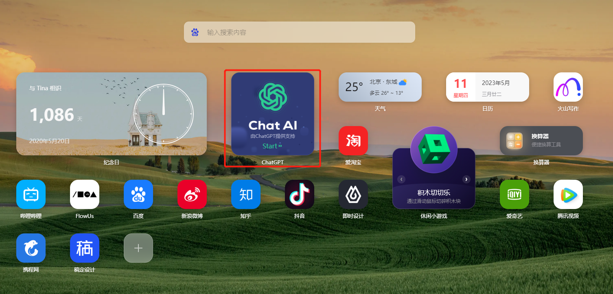
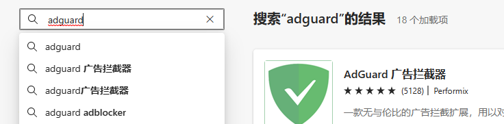
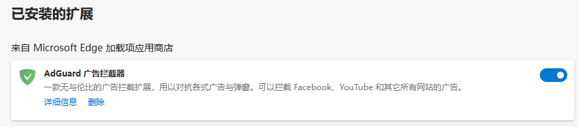
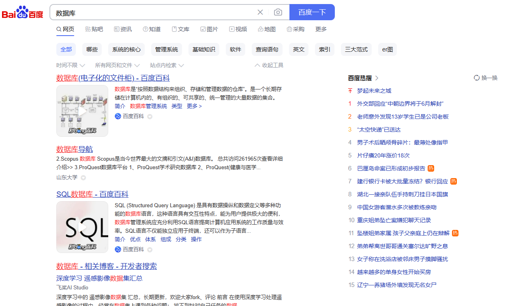

# 提高工作效率，浏览器插件用起来
## 免费使用chatGPT引擎
自从chatGPT问世后，铺天盖地的APP和插件都有了，但从使用效果来看，个人认为从OpenAI直接使用的3.5效果最好，回复也会更符合一些。

::: tip tips
AI给的答案虽好，但是也要基于自己的判断后再决定哦。
:::

不过缺点就是：要翻墙，且要一个外国账号，方可使用。

最近在浏览器的 `扩展程序` 里面发现了一些不错的问答AI，和大家分享一下：

### WeTab

上面整合了chatGPT3.5引擎，可直接国内使用。

基本上浏览器有 `扩展程序` 工具的，基本上都可以添加：

1. 在浏览器扩展应用商店 里面搜索应用

2. 下载后，返回 `扩展程序` 打开开关
> 有的浏览器下载后自动跳转应该就默认会打开了，例如chrome。

3. 试着打开一个新标签，就可以正常使用了。

## 过滤烦人的广告及跟踪器

是不是会有这种烦恼：利用搜索引擎查找东西的时候，在页面第一页永远都是广告，总要往后多翻几页，经常不小心点到广告，各种弹窗……

个人习惯用Google搜索，广告比某0和某度好很多，但是不翻墙是用不了的，而且搜索国内网站会被屏蔽代理，这会又得关闭翻墙，切来切去有点麻烦，所以找了一些插件来挡挡广告，还原浏览器原本功能！

### ADGUARD

不仅仅能过滤浏览器上的广告，而且还能拦截一些广告弹窗，另外也可以通过它关闭追踪器，侧面保护个人信息泄露。

1. 在浏览器 `扩展应用商店` 里面搜索应用

2. 下载后，返回扩展程序 打开开关
> 有的浏览器下载后自动跳转应该就默认会打开了，例如chrome。

3. 通过百度测试一下，远离垃圾广告！~

::: info 未完待续
遇到好玩有趣的插件及应用会不断更新~
:::
