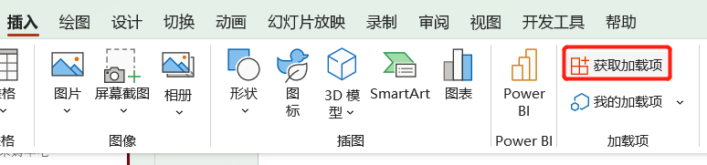
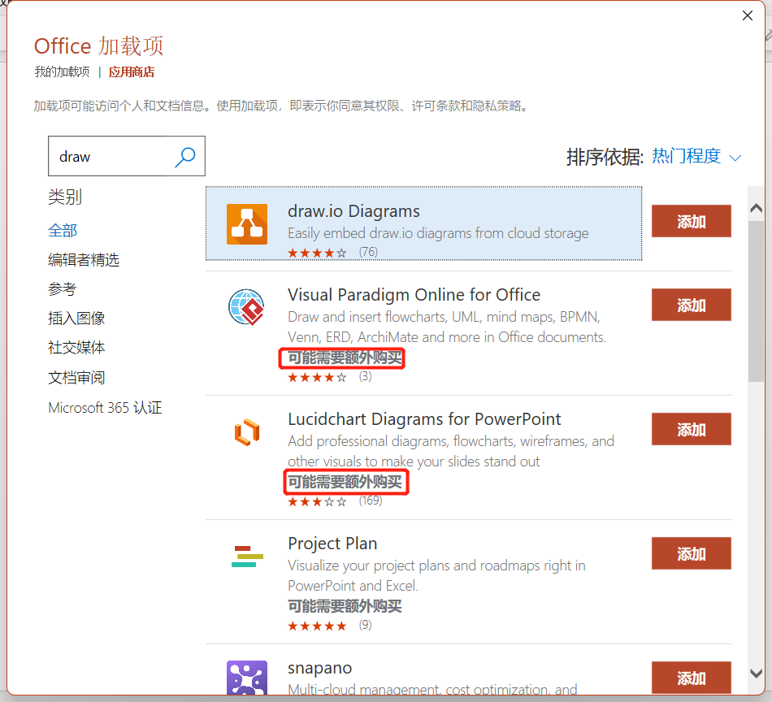
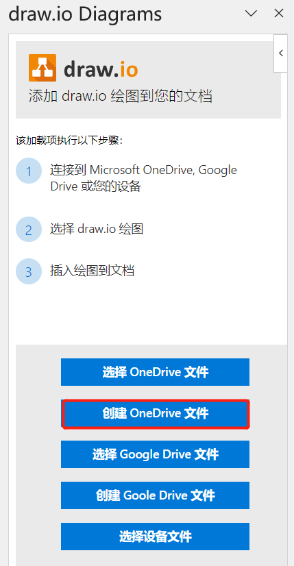
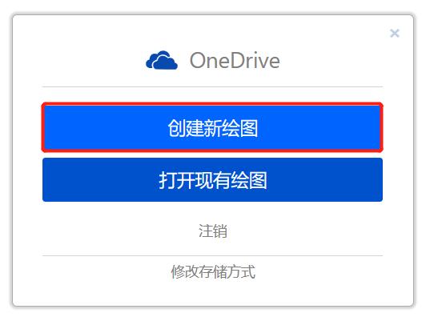
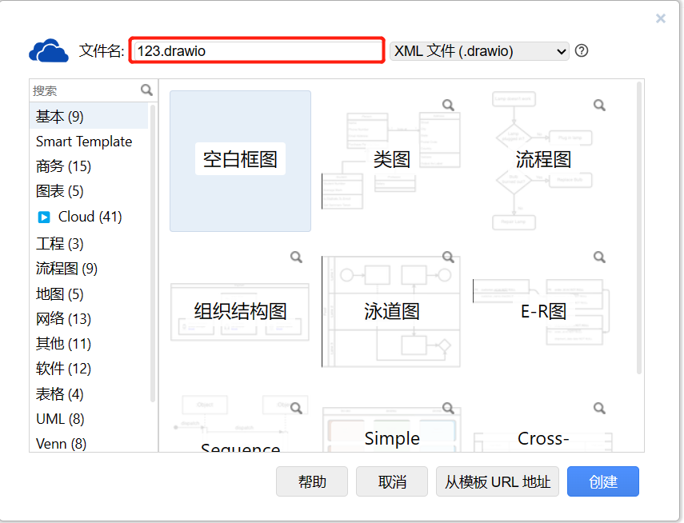
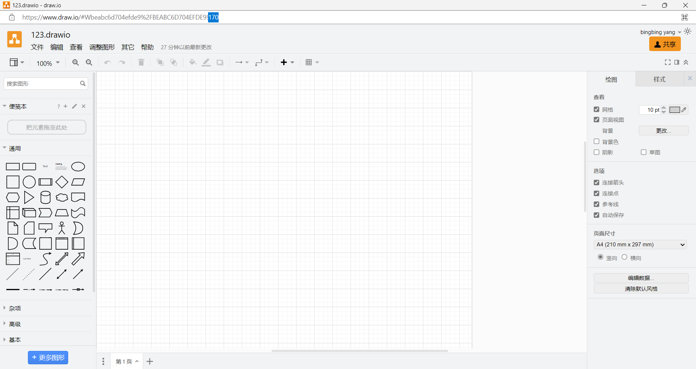

# 还用买Visio会员画图？这羊毛不薅不行了！

## Microsoft Visio

`Visio` 是大家众所周知的运行在Windows操作系统下的流程图软件。其操作简单，应用广泛，甚至有些人利用Visio的强大绘图功能绘制地图、企业logo等。

但使用正版软件是要钱的！价格对于不常使用Visio的人相当不友好，为了偶尔使用一次每年花费几百元会员费也不现实，于是偶然间发现了内嵌于PPT `加载项` 内的简易版Visio。

## draw.io Diagrams

1. 新建PPT，菜单栏中找到 插入 ，选择点击获取加载项 :

2. 进入应用商城，直接输入 `draw` 进行搜索查找即可。如软件有需要收费的，会明确告知，没有提示的一般默认是不收费的。

3. 点击添加之后，在PPT菜单栏的 `插入` 内找到 `我的加载项` ，找到该插件后，会在界面的右侧出现文件选择，点击创建OneDrive文件 →跳转到网页进行授权:

- 命名

> 接着会跳转到Microsoft的登录界面，这里我已经登录过了，所以默认是不需要登录的，Microsoft的账号默认应该是邮箱形式的。

4. 选择对应的存储文件夹

5. 接下来就能够正常编辑了

::: tip
编辑完后还可以导出为`.vxdx` 格式哦~
:::

