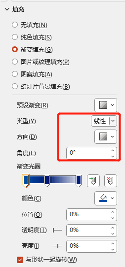
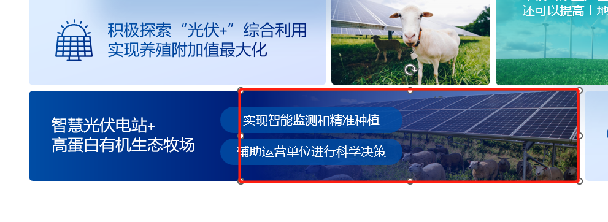

# 这样编辑让你的PPT看起来更舒服

## 善用组合与对齐
稍等，正在思考……

## 善用快捷工具组
稍等，正在思考……

## 把常用的摆在最显眼的地方
稍等，正在思考……

## 对称的美妙
稍等，正在思考……

## 利用渐变效果增加科技感

如果仅仅只是文本+边框，其实就足够让PPT排版看上去很简洁，但是也会让人有一种通版 而`非定制` 的感觉，如图：

但如果加上与图文相关的图片，并置于底层 ，那层次感就会大大增强，如图：

具体操作如下：

1. 提前选定好相关的边框及色调后，利用渐变效果 让边框显得更有层次感，图片要放在哪个位置，便弱化哪个位置的颜色，例如下图所示为左右结构 ，边框设置如下图所示：

2. 寻找一张与文字相符或有关联的图片，并裁剪到与边框同宽；

3. 最后鼠标右键图片选择置于底层 ；

## 利用图层增加立体感

这是不是你在利用`图片`作为背景的排版，让图片在整体排版中，仅发挥背景的作用，但也会使有些`突出点`被遮挡了。

如果把图片中`突出点`单独扣出来
> 例如，这张PPT中打算突出丛林，只是举个栗子，不要深究图文不符哈

那它就会变成这个样子：

::: info 
用一个小细节，增加图片排版立体感~

步骤相对比较简单，就不赘述了~
:::

## 工具参考篇

### UR图标库

https://undraw.co/illustrations

> 可根据颜色修改图标的颜色，下载PNG格式不带底纹

### 免费PNG素材库

https://www.pngsucai.com/

> 这些PNG图片都是免费的，可以组合使用，商用请注意

### PPT模板免费下载

https://www.ypppt.com/tubiao/

> 一些图标逻辑等，可以直接参考，就是配色需要另外自己改改

### 色彩搭配

https://ant.design/docs/spec/colors

> 色彩搭配建议，会给出具体的RGB，拷贝即可使用。除了色彩之外，还有一些网站设计、排版的建议也能提供参考

### 排版设计

https://www.siteinspire.com/websites

> 虽然是一些网站banner的设计，但是有些排版结构值得借鉴，博客首页也可以参考看看哒~