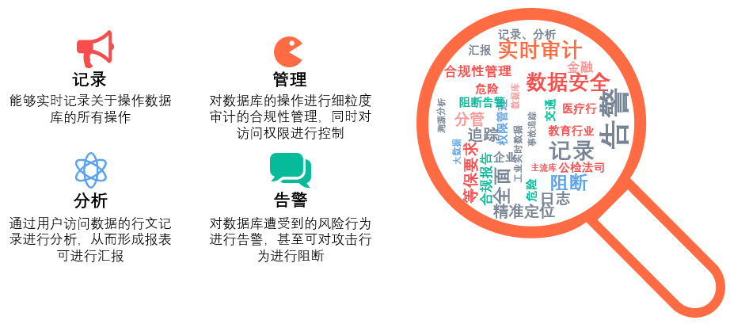

# 十分钟了解数据库的前世今生

## 导读

“是的，你我从未谋面，但是我却知道你的一切，你常叫那一家餐厅的外卖、喜欢的动物、爱逛的网站、最近正在纠结的东西……”

这句话乍一听觉得很浪漫，但实则是非常恐怖的一件事情。通过这些行为，多加分析，对方可以轻易构建出你的性格模型、秉性爱好。

这一切，已经开始萦绕在我们周边了，我们成别人分析的对象。

缘由在于信息的泄露，也就是今天要讲的主题：

` 数据安全。`

今天针对数据安全基础，一起来探索被称为数据安全基础的安全产品：

` 数据库审计系统 `

## 何为数据库安全审计系统

关于数据库安全审计系统，大家或许或多或少能够在身边听到或者主动了解到，这里主要总结为2个特性：

### 数据库审计是面向内部的监控系统

其实计算机世界和我们所存的客观世界是一一对应的，打个比方：

我们创建了一个仓库，一开始业务量很小，仓库中多了什么少了什么，手动统计进行观察很简单。随之业务量的增大，仓库的安全问题显现出来了：
- 根本不知道库内的有多少资产！
- 仓库内东西被偷了也无从查起！
- 还有人利用仓库存放无关物品！

现实生活中为了应对以上情况，最简单基础的方法就是安装摄像头，除了有观察记录的作用，还起到震慑提醒的效果。

计算机世界的数据库也一样，想要掌握数据库出入数据的安全，第一步就是安装“监控”，而数据库审计，则是计算机世界的监控系统。

### 数据库审计是专业化的巡逻防盗系统

如果仓库内的物品价值高，被盗已成事实，那监控系统就成了事后诸葛亮毫无用处了。为了进一步保障仓库的安全，接下来我们会聘请专业人士，进行巡逻防盗。

映射到计算机世界，对于数据库的“巡逻防盗”，数据库审计也有更专业的手段：SQL阻断——在动作发生前，对动作行为进行分析，如果判断符合预先设置的高危动作，直接中止执行操作，防止对数据造成破坏。同时会在同一时间将告警信息推送给管理人员，“抓贼抓脏”，一举拿下！
 
## 数据库审计的历史

数据库审计系统的产生历史可以追溯到20世纪90年代，当时企业开始采用数据库来存储和管理敏感数据。由于数据的重要性和保密性，企业需要一种方法来跟踪和监控数据库的活动，以确保其数据的安全性和合规性。这就促使了数据库审计系统的出现。

### 初期阶段（1990年代至2000年代初期）

在这个阶段，企业开始采用数据库存储和管理敏感数据。由于数据的保密性，企业开始需要一种方法来跟踪和监控数据库活动，以确保其数据的安全性和合规性。

在最最初期，数据库审计是由企业的 IT 人员手动审计数据库的活动，记录数据访问和操作日志，以便跟踪和监控数据库的活动。这个阶段的审计系统是基于手工记录和分析的，效率低下且容易出错

这时，有些企业就自行开发，通常是通过编写自定义脚本或使用数据库自带的日志记录功能来实现。这些系统主要是基于规则的，需要管理员手动配置规则来跟踪数据库活动。

### 自动化阶段（2000年代中期至2010年代初期）

随着企业对数据保护和合规性要求的提高，数据库厂商未来提高自身数据库产品的可靠性，将审计系统内置到数据库当中，为企业提供服务，如常见一下数据库皆带有审计系统功能：

::: info 关系型数据库

SQL server
Oracle
DB2
PostgreSQL
MySQL

:::

::: info 非关系型数据库或其他数据库

MongoDB
Redis
Couchbase

:::

但是由于:

1.	内置的审计系统自动化效果比较低，很多时候需要管理员手动干扰；
2.	能接触到数据库的DBA进入库内任意修改、删除审计日志，缺乏客观性；

于是数据库审计系统开始成为独立于数据库之外的商业化产品。这个阶段的数据库审计系统具有更高级的功能和性能，例如自动化日志记录、实时监控、事件警报、报告和分析等。这些系统可以自动记录、监控和分析数据库活动，并生成实时警报和报告，帮助管理员更快地发现和处理安全事件。

### 智能化阶段（2010年代中期至今）

现代数据库审计系统越来越注重自动化和智能化，以减少管理员的工作量和提高数据安全性。这些系统具有更加智能化的功能，例如机器学习和人工智能技术，可以帮助管理员更好地理解和分析数据库活动，并自动发现安全事件和合规性风险。

### 云端阶段（2020年至今）

随着云计算的兴起，现代数据库审计系统需要支持在云端和混合云环境中的多种数据库和应用程序。这些系统应提供云原生的特性，例如自动缩放、容错性和灵活性等。此外，随着新型数据安全和合规性挑战的出现，现代数据库审计系统需要提供安全事件响应和自动化功能，以帮助管理员更快地响应安全事件和减少人工干预。

目前市面上能实现云原生特性的审计系统还不够贴合，无法如同云服务器般自动伸缩、灵活扩容，这也许和数据库审计产品大多应用在内部运维场景有关。

## 数据库审计的发展趋势

数据库审计系统的发展历程还在继续，随着大数据及人工智能的发展，数据库审计系统正在不断演化和改进，以满足新的数据安全和合规性挑战。粗略预言未来发展趋势，可能会有：

### 进一步的自动化和智能化

随着数据量的倍增，自动化和智能化成了管理员渴求的能力，以此能力来减少管理员的工作量和提高数据安全性，通过客观判断，减少人工干预导致的偏差。

这些系统可以实现自动记录、监控和分析数据库活动、并生成实时警报和预告，协助管理员更快地发现和处理安全事件。

### 面向云端和混合云

随着云计算的兴起，数据库审计系统需要支持在云端和混合云环境中的多种数据库和应用程序。这些系统需要提供云原生的特性，例如自动缩放、容错性和灵活性等。

### 数据可视化和分析

数据库审计系统需要提供数据可视化和分析功能，以帮助管理员更好地理解和分析数据库活动。这些系统可以通过仪表盘、报表和分析工具来展示数据，帮助管理员更好地理解数据安全性和合规性风险。

### 安全事件响应和自动化

现代数据库审计系统需要提供安全事件响应和自动化功能，以帮助管理员更快地响应安全事件和减少人工干预。这些系统可以通过自动化流程、工作流和决策规则来帮助管理员更好地处理安全事件和风险。

## 总结

数据库审计系统在短短30年的时间，从个别需求扩展到必要需求，可以看到企业对数据安全的重视程度。近几年，随着各国陆续颁布的与数据安全相关的法律法规预测，数据库审计系统还将继续承担企业数据安全的基石工作，为其他态势感知、分类分级、事中防御、事后追溯等能力提供安全方向。
